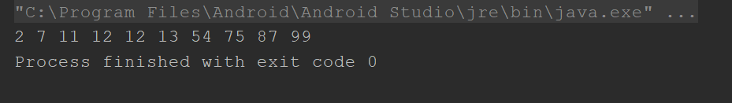
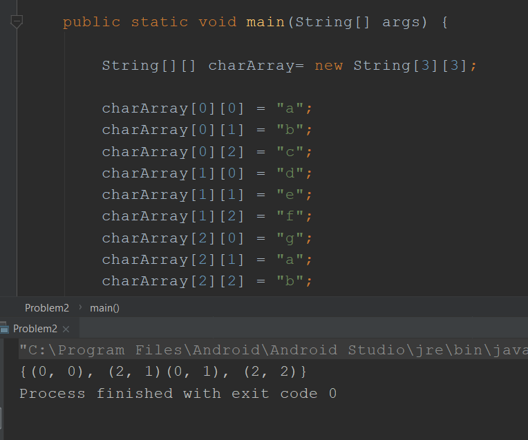
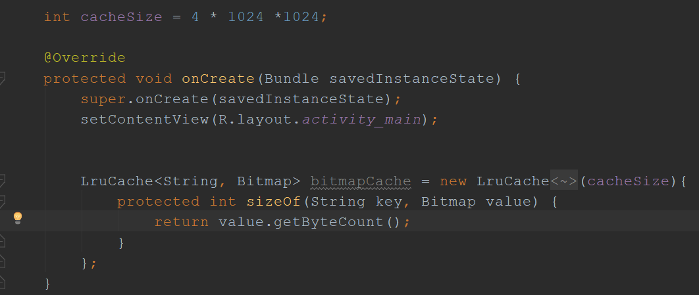
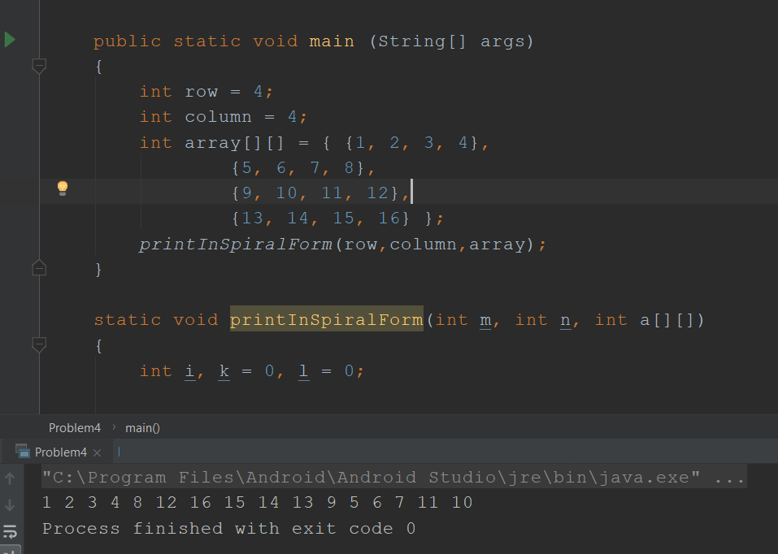
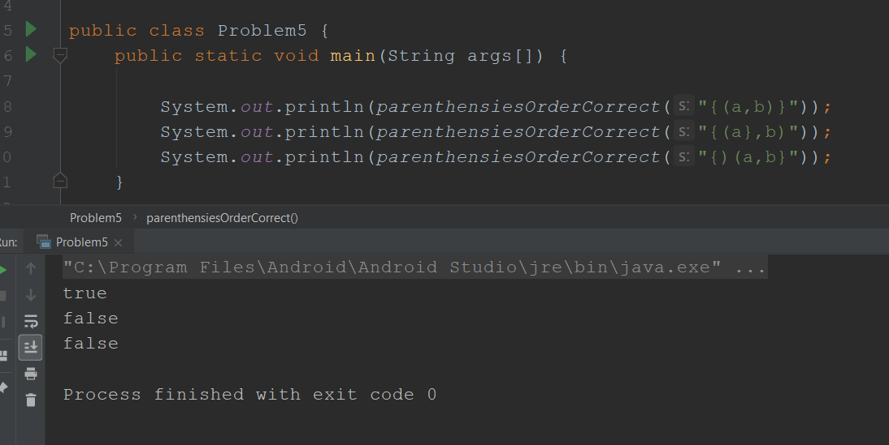

# Week6Daily5TestAssignment
This is the solutions of Weekly coding test. Each problem is in different class. Only the cache problem is in the mainactivity class.

Output of problem 1:

Output of problem 2:

Output of problem 3:

Output of problem 4:

Output of problem 5:

